# NextMiconCherry

🍒 FPGA Board for Beginners

## Schematic

|               |                             | Buy                                              |
| ------------- | --------------------------- | ------------------------------------------------ |
| FPGA          | [iCE40 LP8K](doc/iCE40.pdf) | [digikey](https://www.digikey.jp/short/tc7d9m3n) |
| USB Interface | [FT2232H](doc/FT2232H.pdf)  | [digikey](https://www.digikey.jp/short/h3wjqdqr) |
| SPI Flash     |                             |                                                  |
| Clock         |                             |                                                  |
| LDO 3.3v      |                             |                                                  |
| LDO 1.2v      |                             |                                                  |

## FPGA Configuration
