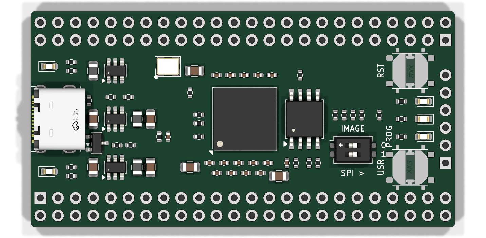
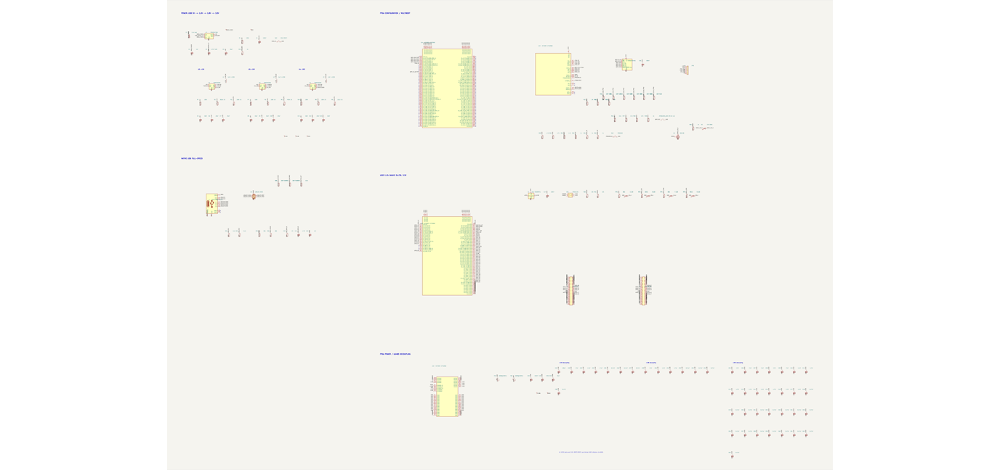

# NextMicon FPGA Boards

NextMicon is a family of open-source FPGA development boards with native USB
and multi-image QSPI boot. Choose the compact Cherry to get started, or Grape
for a larger FPGA and more I/O.

| [🍒 NextMicon Cherry](cherry/) | [🍇 NextMicon Grape](grape/) |
| ----------------------------------- | --------------------------------- |
|  |  |

## 🍒 NextMicon Cherry

**A compact board for learning and small projects.** Cherry is built around
the Lattice iCE40HX8K-BG121, with 7,680 LUTs, 36 GPIO pins, native USB Full-Speed,
and four selectable flash images. The repository includes its KiCad PCB
design, fabrication outputs, bootloader HDL, and host application.

[Explore Cherry →](cherry/)

## 🍇 NextMicon Grape

**A larger board for more ambitious designs.** Grape brings the same
native-USB and multi-image concepts to the AMD Artix-7 XC7A35T, with 56 GPIO
signals and a 128-Mbit QSPI flash. Its schematic is available now; PCB layout
is still in progress.

[Explore Grape →](grape/)
