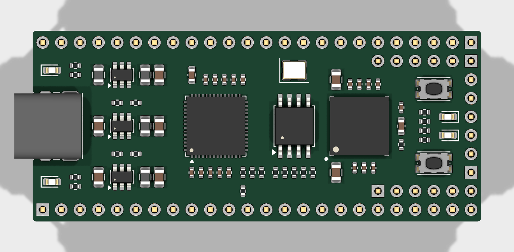
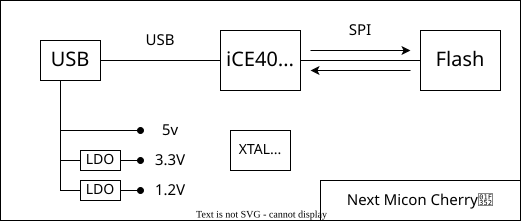

# 🍒 NextMiconCherry

FPGA Board for Beginners

## Schematic

## Specs

- FPGA: Lattice iCE40LP8K-CM81 (7680 LUTs, csBGA-81)
- USB: FT2232H-56Q (Ch A: MPSSE SPI -> Flash, Ch B: UART <-> FPGA)
- Flash: W25Q32JV (32Mbit SPI, auto-boot)
- Clock: 12MHz +/-25ppm XO, shared by FT2232H (OSCI) and FPGA (GBIN5)
- Power: USB 5V -> 3.3V / 1.2V (TPS62A02 buck x2)
- Protection: USBLC6-2SC6 ESD array on USB D+/D-/VBUS
- GPIO: 53 pins (3.3V logic), 1x24 PinHeader x2 + 1x06 PinHeader x3
- UI: RESET / USER buttons, PWR / CFG / USER0 / USER1 LEDs
- Board: 61mm x 26mm, 2-layer FR4

## Pinout

| Header                            | Pins                                                        |
| --------------------------------- | ----------------------------------------------------------- |
| J2 (bottom row, pin 1 = USB side) | 1 = 5V, 2 = 3V3, 3-5 = GND, 6 = CRESET_B, 7-24 = GPIO_1..18 |
| J3 (top row, pin 24 = USB side)   | 24 = 5V, 23 = 3V3, 22-19 = GND, 1-18 = GPIO_19..36          |
| J4                                | GPIO_37..42                                                 |
| J5                                | GPIO_43..48                                                 |
| J6                                | GPIO_49..53, pin 6 = GND                                    |

## BOM

| Ref     | Part                                  | Package       | Description            | Cost   | Buy                                                                                                                             |
| ------- | ------------------------------------- | ------------- | ---------------------- | ------ | ------------------------------------------------------------------------------------------------------------------------------- |
| U1      | [FT2232H-56Q](data/FT2232H.pdf) *(2)* | VQFN-56       | Dual USB UART/MPSSE    | $5.20  | [digikey](https://www.digikey.com/en/products/detail/ftdi-future-technology-devices-international-ltd/FT2232H-56Q-TRAY/5994773) |
| U2      | W25Q32JVSSIM *(1)*                    | SOIC-8 208mil | 32Mbit SPI Flash       | -      | [digikey](https://www.digikey.com/en/products/result?keywords=W25Q32JVSSIM)                                                     |
| U3      | [iCE40LP8K-CM81](data/iCE40.pdf)      | csBGA-81      | FPGA 7680 LUTs         | $11.55 | [digikey](https://www.digikey.jp/short/tc7d9m3n)                                                                                |
| U4-U5   | [TPS62A02](data/TPS62A02.pdf)         | SOT-23-6      | 2A DC-DC Converter     | $0.25  | [digikey](https://www.digikey.jp/ja/products/detail/texas-instruments/TPS62A02PDDCR/22147220)                                   |
| D5      | USBLC6-2SC6                           | SOT-23-6      | USB ESD protection     | -      | [digikey](https://www.digikey.jp/ja/products/result?keywords=USBLC6-2SC6)                                                       |
| X1      | ASE-12.000MHZ-LR-T                    | 3.2x2.5mm     | 12MHz XO (+/-25ppm)    | -      | [digikey](https://www.digikey.com/en/products/detail/abracon-llc/ASE-12-000MHZ-L-R-T/2637762)                                   |
| FB1-FB2 | BLM21AG601SH1D                        | 0805          | Ferrite bead (USB/PHY) | $0.19  | [digikey](https://www.digikey.jp/ja/products/detail/murata-electronics/BLM21AG601SH1D/2588067)                                  |
| J1      | USB4085-GF-A                          | SMD 16pin     | USB-C connector        | $1.01  | [digikey](https://www.digikey.jp/ja/products/detail/gct/USB4085-GF-A/9859662)                                                   |
| J2-J3   | Pin header 1x24                       | 2.54mm Pitch  | GPIO                   | -      | generic                                                                                                                         |
| J4-J6   | Pin header 1x06                       | 2.54mm Pitch  | GPIO                   | -      | generic                                                                                                                         |

*(1)* W25Q32JVSSIM (industrial grade). The commercial-grade W25Q32JVSSIQ (same footprint, drop-in compatible) is listed as EOL at some distributors.

*(2)* FT2232H-56Q stock is tight (DigiKey out of stock as of 2026-08, 38-42 week factory lead). Check Mouser/other distributors before ordering. Same silicon as FT2232HQ (QFN-64, usually in stock), which fits the previous rev footprint.

### Passives

| Ref                                        | Value           | Package | Qty | Notes                                      |
| ------------------------------------------ | --------------- | ------- | --- | ------------------------------------------ |
| C1-C2                                      | 10uF            | 0805    | 2   | 5V input bulk                              |
| C3-C4                                      | 22uF            | 0805    | 2   | 3V3 / 1V2 Buck output                      |
| C14, C18, C24                              | 10uF            | 0805    | 3   | Rail bulk (+3V3A / +1V2 / +3V3)            |
| C11                                        | 4.7uF           | 0603    | 1   | FT2232H VREGOUT/VCORE                      |
| C27                                        | 10uF            | 0603    | 1   | iCE40 VCCPLL filter                        |
| C5-C10, C12-C13, C15-C17, C19-C23, C25-C26 | 100nF           | 0402    | 18  | IC decoupling (C26 = VCCPLL filter)        |
| L1-L2                                      | 1uH             | 0805    | 2   | Buck inductor (pick Isat >= 1.5A)          |
| R1                                         | 100k            | 0402    | 1   | 3.3V feedback divider (1%)                 |
| R2                                         | 22k             | 0402    | 1   | 3.3V feedback divider (1%)                 |
| R3-R4                                      | 100k            | 0402    | 2   | 1.2V feedback divider (1%)                 |
| R5-R6                                      | 5.1k            | 0402    | 2   | USB-C CC pull-down                         |
| R7                                         | 12k             | 0402    | 1   | FT2232H REF resistor (1%)                  |
| R8, R9, R11, R12                           | 10k             | 0402    | 4   | Pull-ups: FT RESET#, CRESET_B, SPI_SS, BTN |
| R10                                        | 1k              | 0402    | 1   | CDONE pull-up                              |
| R13                                        | 100             | 0402    | 1   | iCE40 VCCPLL filter                        |
| R14-R17                                    | 470             | 0402    | 4   | FT2232H ch-A series (bus contention guard) |
| R18                                        | 1k              | 0402    | 1   | FT2232H -> CRESET_B series                 |
| R19-R22                                    | 1k              | 0402    | 4   | LED current limiting                       |
| D1-D4                                      | LED             | 0603    | 4   | PWR / CFG / USER0 / USER1                  |
| SW1-SW2                                    | Tact (C&K KMR2) | SMD     | 2   | RESET / USER button                        |

## Build

Toolchain: [Yosys](https://github.com/YosysHQ/yosys) + [nextpnr-ice40](https://github.com/YosysHQ/nextpnr) + [icestorm](https://github.com/YosysHQ/icestorm)

Programming: [iceprog](https://github.com/YosysHQ/icestorm) via FT2232H Channel A (MPSSE SPI)
